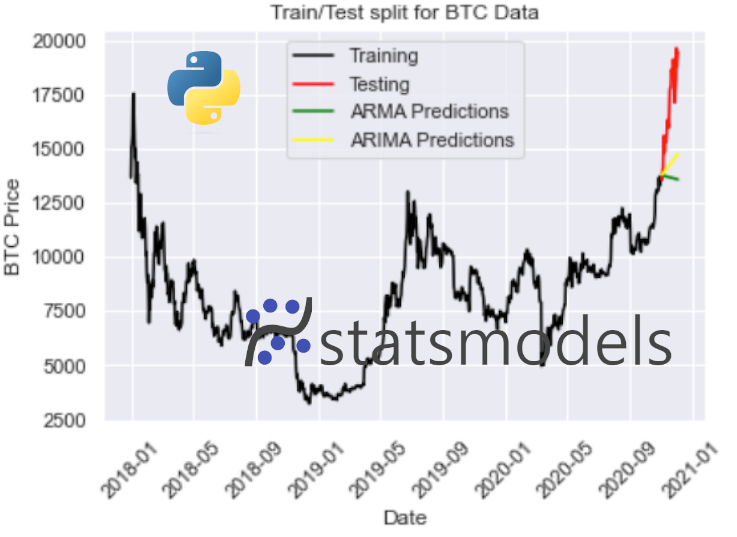

# Time Series Forecasting in Python

This a repository from my learnings on time series forecasting in Python. 

## Contents

The notebooks in this repository go over:

1. [Introduction to Facebook's Prophet forecasting package](https://github.com/StatsGary/time-series-forecasting-python/blob/main/00-Intro-to-Facebook-Prophet.ipynb)
2. Variables and data types intro (skip if you know this)
3. Prophet forecasting evaluation metrics (MAPE, MAE, RMSE)
4. Descriptive statistics with `statsmodels`
5. Working with dates and times
6. Looking at time resampling and how this can be used to split data
7. Time shifting - random walks, and other methods
8. Rolling and expanding time window methods
9. Visualising time series
10. Changing seasonality
11. Introduction to `statsmodels`
12. ETS (Error Trend Seasonality) modelling
13. Exponential Weighted Moving Averages (EWMA)
14. Holts-Winters Exponential Smoothing
15. Introduction to forecasting
16. ACF and PACF plotting
17. Autoregression with stats models
18. Descriptive time series and testing methods
19. Choosing ARMA orders 
20. ARMA, ARIMA and SARIMA Autoregression models
21. Season Arima with exogenous variables
22. Vector Autoregressions
23. Prophet Python forecasting